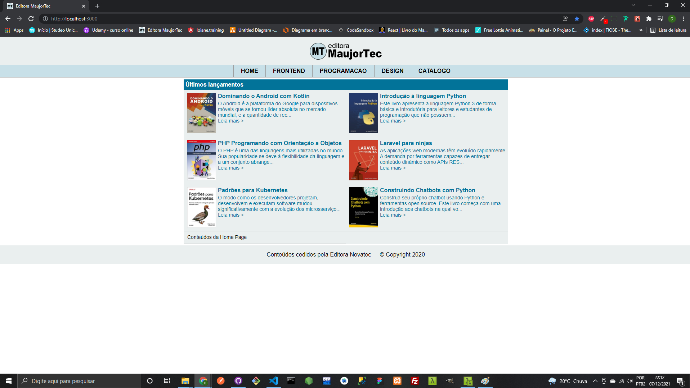
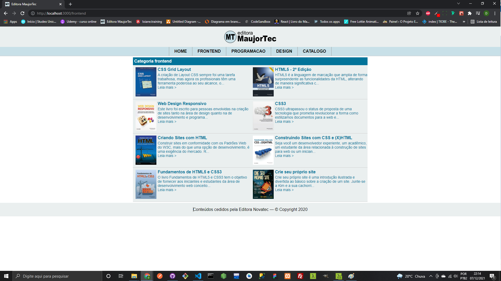
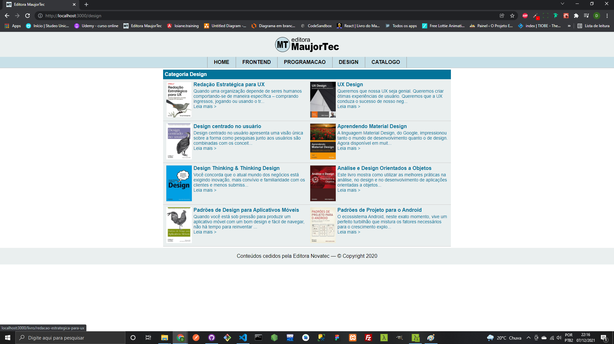
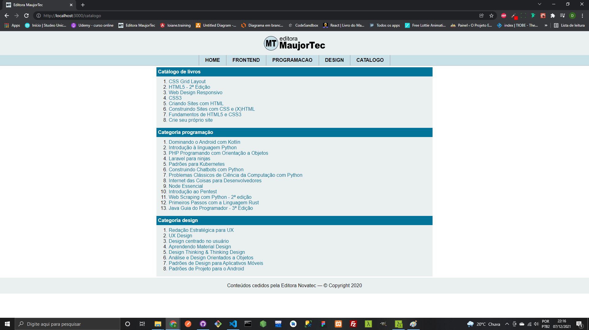

# Projeto MaujorTec
 
### Olá! Eu sou Danielle Torres 👋

### Criei este Projeto MaujorTec com o intuito de aprofundar meus conhecimentos em React. Este exercício foi tirado do livro React Aprenda Praticando, autor Maujor Samy Silva.

### Este site está hospedado na Netlify: clique neste <a href="https://site-maujortec-livros-programacao.netlify.app"> link </a> para abrir o site

### Seguem abaixo as imagens do site em React: 

 

    
    
    
    
    
      

### Tecnologia utilizada

     

